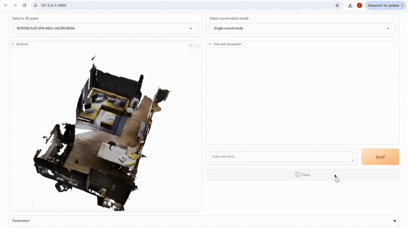

<h2 align="center">
  <b>SPARTUN3D: Situated Spatial Understanding of 3D World in Large Language Models</b>
</h2>

<!-- <h3 align="center">
ICLR 2025
</h3> -->
<div align="center">
    <a href="https://arxiv.org/pdf/2410.03878" target="_blank">
    </a>
</div>



## Get Started
1. Clone Github repo.
```shell
git clone https://github.com/zhangyuejoslin/Spartun3D.git
cd Spartun3D
```
2. Following [LEO](https://github.com/embodied-generalist/embodied-generalist/blob/main/README.md?plain=1) to create a conda environment and install third-party libraries for point cloud backbones.

## Generating Data for Spartun3D

1. **Generate Metadata**  
   Run `scene_process.py` to collect raw spatial information. We provide the metadata at: [Google Drive Link](https://drive.google.com/file/d/1X7HebPFqU92RfuanCAZhtfJ7CWHLOQG8/view?usp=drive_link).  

2. **Generate Data with GPT-4o**  
   Run the code in `gpt_code` to generate data using GPT-4o. Please provide your OpenAI API key.

3. **Post-Process the Generated Data**  
   Use `data_process/3Rscan/gpt_code/post_process.py` to refine the generated data.

4. **Generated Captions and QA Pairs**  
   We provide the generated captions and question-answer pairs in `data_process/spartun3D_data`.  
   Please download the corresponding scene data from [LEO](https://huggingface.co/datasets/huangjy-pku/LEO_data/blob/main/3RScan-ours-align.zip).  


## Train and Test

 **python launch**
```bash
python launch.py --mode python --config configs/default.yaml
```

 **accelerate launch**
```bash
python launch.py --mode accelerate --config configs/default.yaml
```
 **SQA3D Eval**
 
[sqa3d checkpoint](https://drive.google.com/drive/folders/1Q27w0K3NVrqLS4GKonYLMMN8e1j_raXD?usp=sharing)